# CIS565 Fall 2015 - Final Project

## CUDA-accelerated Crowd Simulation with HRVO and ClearPath

Levi Cai (www.levicai.com)

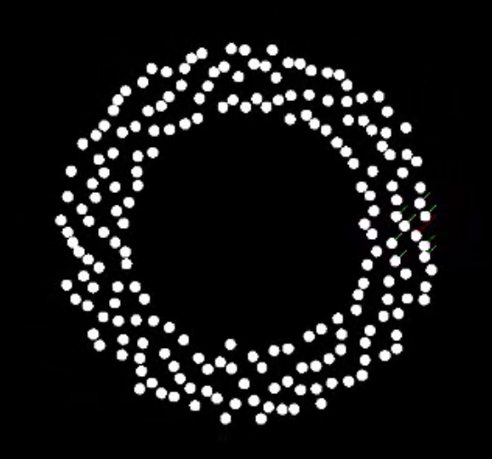

Final video: https://www.youtube.com/watch?v=9E0RYBbbvJQ&feature=youtu.be

Final presentation: https://docs.google.com/presentation/d/1MXH-gVVsqWDP741cm3D0KGq5vxWAhtXCxeXZsPsarFs/edit?usp=sharing

Papers/Resources Used:
* HRVO logic from Snape (NOTE: this does not actually follow "proper ClearPath"): https://github.com/snape/HRVO
* ClearPath paper: http://gamma.cs.unc.edu/CA/ClearPath.pdf
* General collision avoidance: http://gamma.cs.unc.edu/CA/
* RVO paper: http://gamma.cs.unc.edu/RVO/
* HRVO: http://gamma.cs.unc.edu/HRVO/
* HRVO paper: http://gamma.cs.unc.edu/HRVO/HRVO-T-RO.pdf
* Uniform Grid explanation: https://github.com/jeremynewlin/Accel

Special thanks to the authors: Prof. Stephen Guy and Prof. Ming Lin

## Debug view:

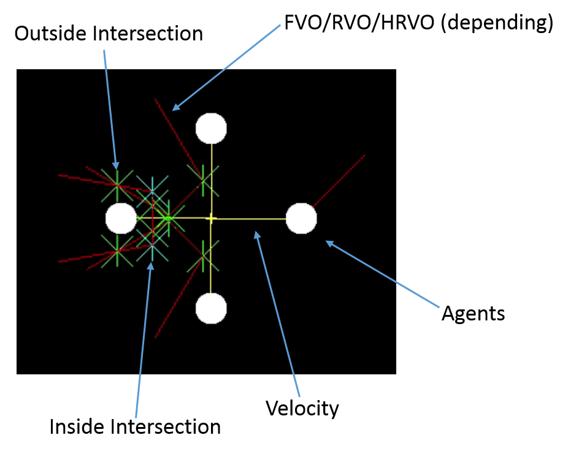

## Final Algorithm Overview

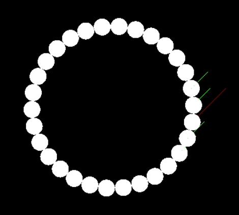

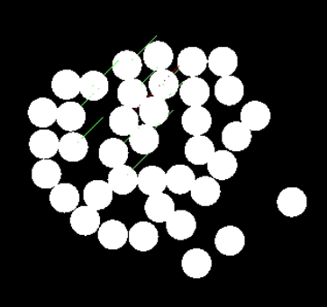

### General Approach

The general approach to all of the above algorithms for collision avoidance is to model all velocities of every agent that *will* results in a collision. Then, if the current velocity is inside the set of colliding-velocities, to find the velocity nearest to the original, but is no longer in the set of colliding velocities. The primary differences between the 3 algorithms attempted here are what consistitutes the boundaries defining colliding/restricted velocities and how to compute the best velocity from the set of non-colliding velocities.

The latest approach with the most stable results are provided by HRVO, and it is extended here on CUDA by utilizing ideas from the ClearPath paper and Snape's HRVO implementation. The algorithm is thus:

Parallelized across agents:
 * For each agent find its neighbors

Parallelized across neighbors (use stream compaction to only iterate over agents with the same # neighbors at a time):
* For each neighbor, compute the 
* For each neighbor, compute the HRVO between the original agent and the neighbor

Parallelized across HRVOs:
* Compute the intersections between each HRVO with all boundaries of all other HRVOs
* Compute the projection of the original agent's desired velocity onto all the boundaries relating to it
* Compute the proejction of the maximum velocity of each agent onto all the boundaries relating to it
* The resulting points are all the possible velocity candidates relating to their respective agents

Parallelized across candidates:
* Compute valid candidates (ones that are not inside any other HRVO region)

Parallelized across agents:
* From their respective candidate lists, pick the best valid candidate

### Optimizations

I implemented a uniform grid for nearest neighbor computations as well as a few implementations of stream compaction for the parallelization steps in order to get semi-reasonable performance. There are some other ideas present in the ClearPath paper for additional optimizations, but I did not have a chance to implement them fully. It is important to note that the Uniform Grid actually did not improve performance that much for smaller samples of robots (< 200), which is the only set that I have stable simulations for.

## Things I tried

#### FVO with ClearPath

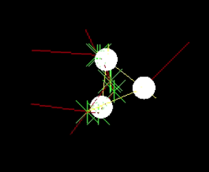

For my first attempt, I implemented the algorithm from the **ClearPath paper**, including FVOs (3 constraints), and the full intersection computation and inside/outside classifications. The full code for this implementation is available at commit aab96587f677be6439d2f293825ed827a7786f8d.

The idea for this algorithm is to model 3 different contraints. These 3 linear constraints are the boundaries of the velocities that result in collisions. Once all the agent pair-wise constraints have been computed, we then compute the intersection of all the boundaries, label them as inside/outside the colliding region of the other pair-wise constraints, and then find the velocity along the segments that are outside the other constraints. This velocity, if computed properly, is thus guaranteed to avoid collisions. However, due to the 3rd constraint, there are lots of symmetries and small epsilon differences that greatly effect the resulting inside/outside classifications and thus can give strange results.

As clarified by Prof. Guy, is highly susceptible to floating point issues when using the 3rd constraint and the intersection classification algorithm. But I did get it to work for 3 robots: https://www.youtube.com/watch?v=VDhIFXhSx-o
and here it is breaking on 4: https://www.youtube.com/watch?v=BA9yAxEHa7g

#### RVO with randomly sampled velocities

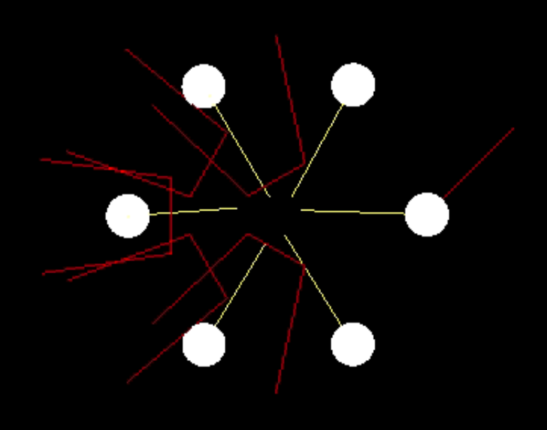

For my second attempt, I implemented the algorithm from the **RVO paper**. The code can be found at commit f36f3dac8df5fd02a8e89d28cd8474b8a350a8e3. Here the difference is that we no longer compute intersection points and find velocities along the boundaries. Instead we compute the velcoity regions that result in collisions as before, but for each agent we randomly sample _N_ velocities (I used _N_ = 250 as in the paper). We then select the velocity that is nearest to the desired velocity AND is not inside the colliding regions. This resulted in a slightly easier-to-compute algorithm and worked fairly well for up to 6 robots: https://www.youtube.com/watch?v=HOVsiz8CZ-4&feature=youtu.be. Beyond that it seemed to give strange results.

#### HRVO with ClearPath

Then from Prof. Stephen Guy's advice, I implemented HRVO with ClearPath on CUDA. See final algorithm above for details.

## Performance Analysis

Note: This is not heavily optimized and it not a particularly stable implementation, so there could be differences once things are fixed more.

### Overall comparison of HRVO+ClearPath on CUDA vs. CPU

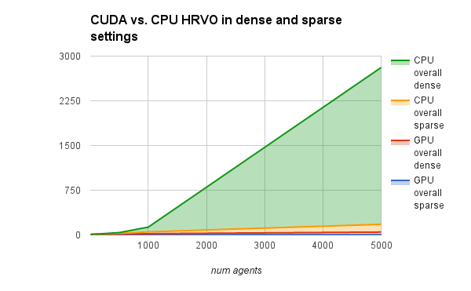

Units on left are ms.

DISCLAIMER: This was tested against Snape's implementation which uses a KD-tree spatial optimization (vs. my uniform grid), so this would need to be ignored/compared to be more accurate.

The GPU here gives significant advantage over the CPU implementation for large numbers of agents, especially if they are fairly densely packed. However, for smaller numbers of agents, or for sparse settings, the advantage is not necessarily as clear and both can run at 30+ FPS fairly well (GPU at 60+ FPS for longer).

### Uniform Grid vs. Naive Nearest Neighbors on CUDA and CPU

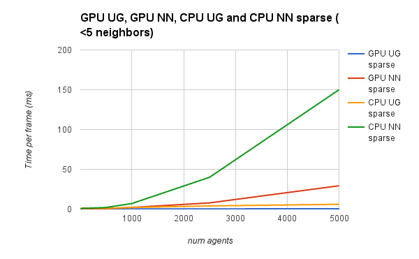

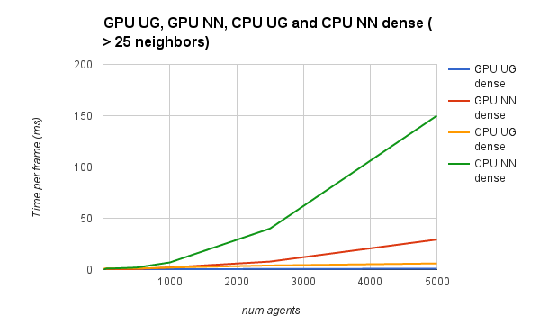

Here we can see the effectiveness of the Uniform Grid optimization. It gives us the most benefit when there are a large number of neighbors to consider, again, with < 100 agents or so, the difference is quite small, and in fact in smaller number of agents, the naive nearest-neighbor computation is actually faster. It is also clearly affected by the sparsity of the agents relative to the size of the neighborhood being considered.

### Kernel runtimes

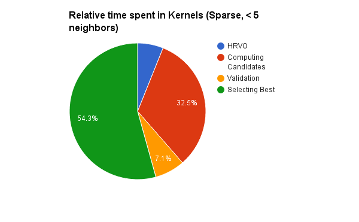

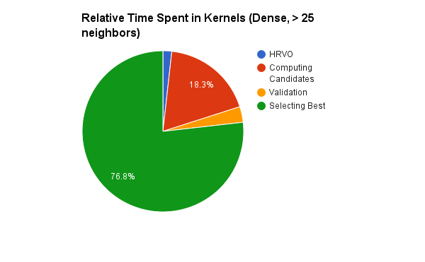

Here we can see the relative time spent doing certain actions. Most of the time, both in dense and sparse settings, is spent picking the best velocities. This is because the selection algorithm is incredibly naive (iterates through ALL possible velocity candidates before selecting the one nearest to the current velocity that is also valid). There are several possible optimizations here, such as stream compacting out the invalid ones, somehow sorting beforehand, and only selecting a new velocity when absolutely necessary (the sparse one does not need to spend that much time picking a new velocity). The other ones make sense overall, as generating candidates should take an order of magnitude longer than the rest as there are 2*N + 4*N + 4*(N-1)*(N-2) possible candidates per agent.

