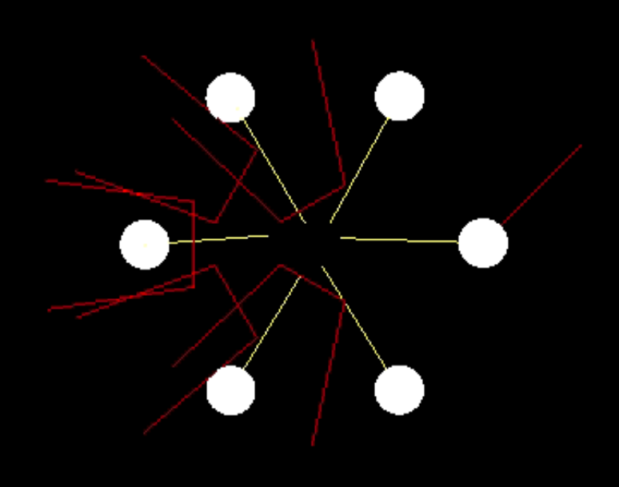

CIS565 Fall 2015 - Final Project

HRVO using ClearPath on CUDA

NOTE: Intersection computation is heavily borrowed from the original HRVO implementation (from Snape: https://github.com/snape/HRVO)

For my final project I am planning to implement the P-ClearPath algorithm for collision avoidance for multi-agent systems. In robotics, collision avoidance is especially important, since we use very expensive yet very fragile equipment (oh the curses of real things, they break!) Thus in large scale multi-robot settings, say in Amazon’s warehouses, it is important to be able to compute collision-free paths for large numbers of robots simultaneously. Depending on the algorithm anyway, a GPU can help, and according to the P-ClearPath paper, this should be the case.

The paper I will be referencing can be found here: http://gamma.cs.unc.edu/CA/ClearPath.pdf

Additional videos and materials can be found here: http://gamma.cs.unc.edu/CA/

Initial Demo

Hope to have a simple version of the P-ClearPath algorithm running with the simple N-body simulator, probably just in 2D since all the P-ClearPath examples are in 2D. No optimizations expected, just want to see at least 2-5 robots avoid each other.

Milestone 1

Implement CPU version for comparison? 

Milestone 2

Implement the Uniform Grid optimization

Milestone 3

ALLLLL the performance checks. If there is time, extend it for non-straight paths in environments with obstacles.
